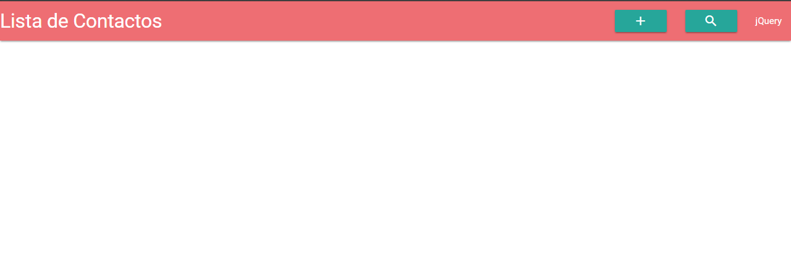
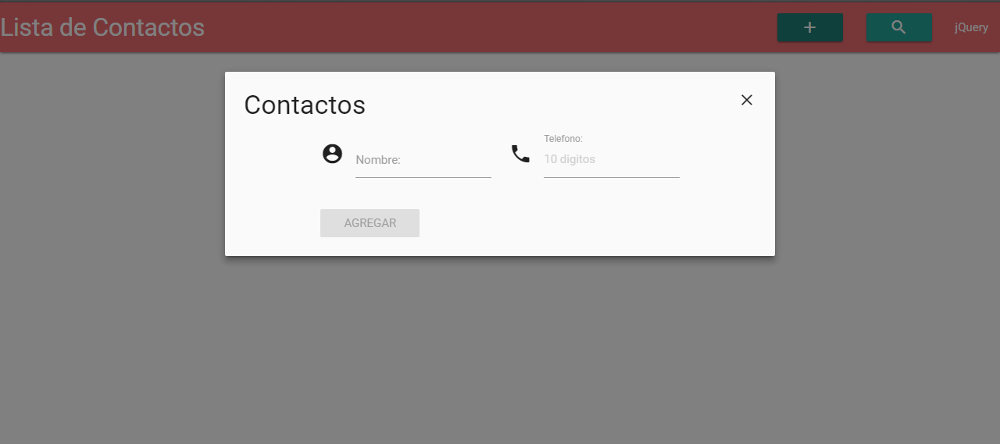
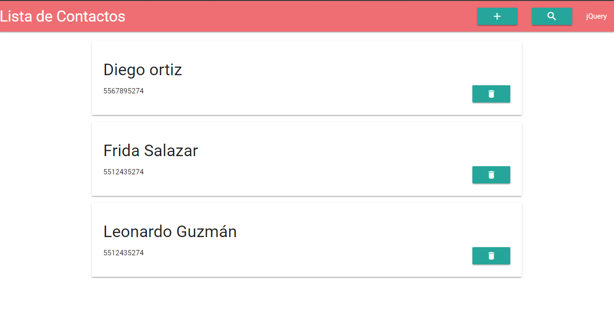

# ♡ AGENDA DE CONTACTOS ♡
Crea una agenda de contactos donde puedas agregar, eliminar, filtrar y contabilizar a los contactos.

A través de un modal debes poder agregar:

* Nombre de contacto
* Número telefónico
* Email (opcional)

El contacto creado debe agregarse en nuestro HTML con un botón/ícono que nos de la opción de eliminar el contacto.

